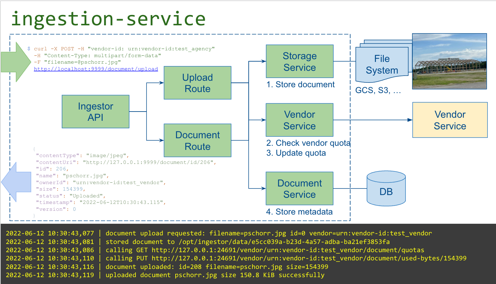

ingestion-service
================


## Overview
The `ingestion-service` utilizes Akka Http to provide an asynchronous, streaming API.

On accepting and validating an upload request (POST, multipart/form-data), the 
byte stream and metadata are passed to the Upload route, which first calls the
Storage service to stream the bytes to a file system file, before calling Agency
service (now that it knows the size of the upload), to verify the agency has upload
quota available.  

If not, the file is deleted from store and an appropriate error is
returned.

If all ok, a metadata record is written to the quotas table, and a Json response returned,
containing a `contextUrl` field that may be used for future manipulation of the document
([see API doc](docs/API.adoc))



[A good intro to Akka streams from Zalando](https://engineering.zalando.com/posts/2017/01/about-akka-streams.html)

## Building
### Test Coverage

```shell
$ sbt 'set coverageEnabled := true' clean coverage test coverageReport
```
Coverage report: `docs/coverage/scoverage-report/index.html`

### Docker Image
Build a docker image:
```shell
$ sbt docker:publishLocal
```
Running docker image locally:
```shell
$ docker run \
 --env SERVER_PORT=8080 \
 --env API_PORT=8081 \
 --env SPRING_CLOUD_SERVICE_REGISTRY_AUTO_REGISTRATION_ENABLED=true \
 --net=host anized/ingestion-service:2022.02
```

See also: [starting Postgress](docs/PostgresDocker.adoc)

### Run demo in Nomad
To run this service as part of the Nomad demo

[Nomad](docs/Nomad.adoc)

### API
Description of the REST API form document upload and download exposed by the service

[API](docs/API.adoc)